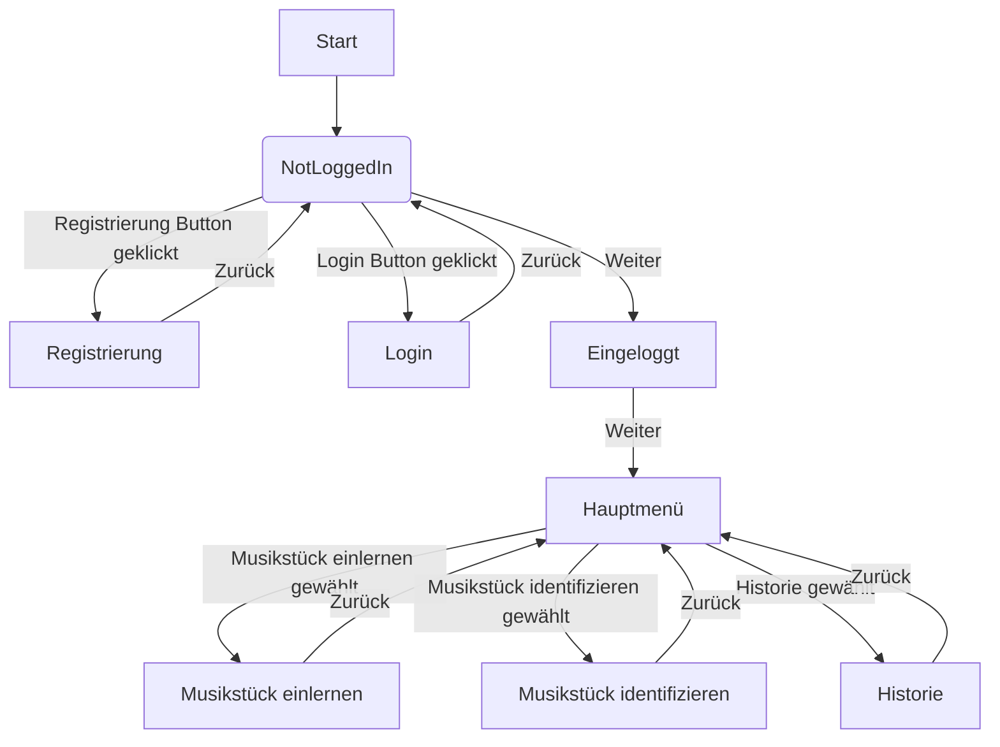

# HarmonyHunter

HarmonyHunter ist eine Anwendung zum Einlernen und Identifizieren von Musikstücken. Die Anwendung ermöglicht es Benutzern, Wav-Dateien hochzuladen, um sie zu einem Musikerkennungssystem hinzuzufügen oder sie aufgenommene Musikstücke identifizieren zu lassen. Die Anwendung bietet auch eine Historie-Funktion, um alle identifizierten Musikstücke anzuzeigen.

## Installation

Um HarmonyHunter lokal auszuführen, führen Sie die folgenden Schritte aus:

1. *Klonen Sie das Repository auf Ihren lokalen Computer:*

    bash
    git clone https://github.com/username/HarmonyHunter.git
    

2. *Wechseln Sie in das Verzeichnis des Repositorys:*

    bash
    cd HarmonyHunter
    

3. *Installieren Sie die erforderlichen Python-Abhängigkeiten:*

    bash
    pip install -r requirements.txt
    

4. *Führen Sie die Anwendung aus:*

    bash
    streamlit run user_interface.py
   
## Anwendung

- Anwendung ausführen
- Registrierung und anschließende Anmeldung
- Upload der beigefügten Wav-Dateien
- Abspielen durch Musik-Player
- Musikstück durch Mikrofon oder Upload identifizieren
- Links zu verschiedenen Streaming-Anbietern
- History der erkannten Musikstücke einsehen

## UML-Diagramm

Zum Anzeigen des UML-Diagramms in Visual Studio Code ist die Erweiterung "Markdown Preview Mermaid Support" erforderlich.

## Features

- Einlernen von Musikstücken durch Hochladen von Wav-Dateien.
- Identifizieren von Musikstücken durch Aufnahme oder Hochladen von Wav-Dateien.
- Anzeige des Albumcovers.
- Anzeige der Historie aller identifizierten Musikstücke.
- Bereitstellung von Links zu YouTube, Apple Music und Spotify für identifizierte Musikstücke.

## Umgesetzte Erweiterungen

- Integration von externen APIs zur Bereitstellung von Albumcovern und Musiklinks.
- Implementierung einer HistoryManager-Klasse zur Verwaltung der Historie.
- Hinzufügen von Funktionen zur Identifizierung von Musik über aufgenommene Audiodateien.
- Verwendung von TinyDB für die Speicherung von Daten.
- Implementierung von Registrierung und Login.

## Verwendete Quellen

- [Streamlit Dokumentation](https://docs.streamlit.io/)
- [TinyDB Dokumentation](https://tinydb.readthedocs.io/en/latest/)
- [Python Documentation](https://docs.python.org/3/)

## Beitragende

- Nora Neumair (@noran711)
- Julian Raab (@JulianRaabMCI)
- Lenard Wild (@wildle)

Bitte beachten Sie, dass dieses Projekt für Bildungszwecke gedacht ist und noch nicht für den Produktiveinsatz geeignet ist.
